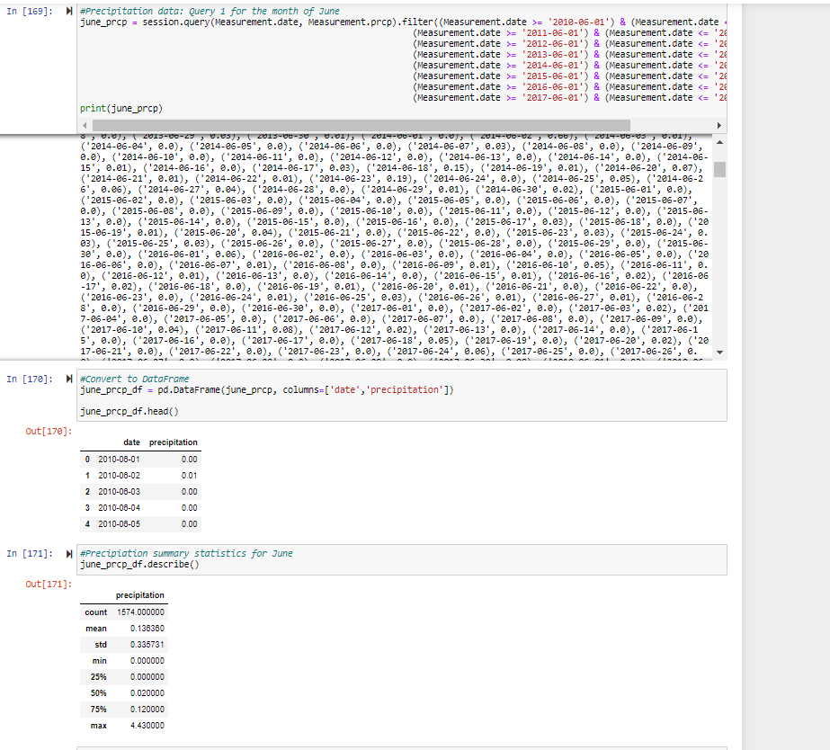
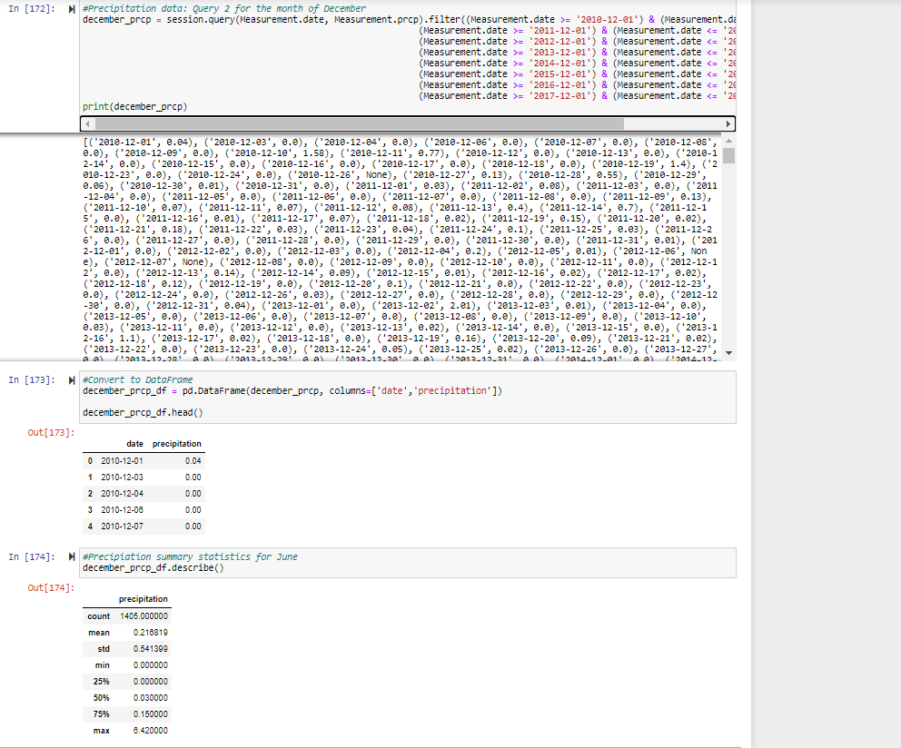

# surfs_up
SQLite, SQLAlchemy, Flask

# Overview of the statistical analysis:

The purpose of the analysis is to identify temperature trends in Oahu, Hawaii to determine if a surf and ice cream shop business is sustainable year-round. For this part of the analysis, temperature data for the months of June and December in Oahu will be analyzed. 

# Results:

## The following list addresses the three key differences in weather between June and December. 
- For June, the average temperature was 74.9&deg;F while the average temperature was lower for December with a calculated average of 71.0&deg;F for December.
- For June, the minimum temperature was 64.0&deg;F while the minimum temperature value was lower for December with a minimum temperature of 56.0&deg;F for December.
- For June, the maximum temperature was 85.0&deg;F while the maximum temperature value was lower for December with a maximum temperature of 83.0&deg;F for December.

# Summary:

There is a high-level summary of the results and there are two additional queries to perform to gather more weather data for June and December. 
It can be determined that although there are differences in temperature and precipitation for June and December, the data does not vary drastically as shown in the summary statistics. A surf and ice cream shop business is feasible in Oahu.

Queries 1 and 2 were performed for June and December to show precipitation data for the two months. In June, the average precipiation had a low value of 0.136 while in December, the average precipitation was higher with a value of 0.217. The summary statistics of precipitation for June and December show that December generally experiences higher precipitation.

*The following images show the queries performed for each month:*

- Image 1:

- Image 2: 

